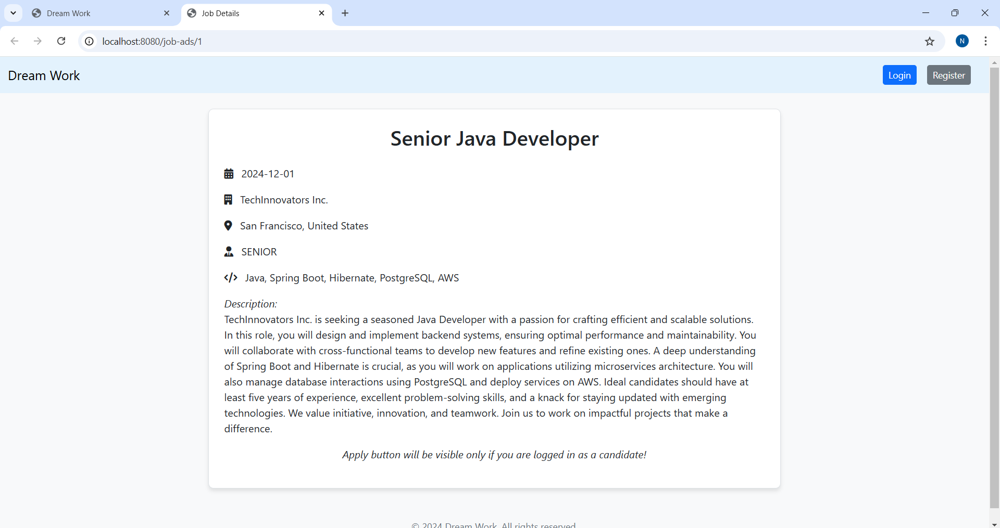
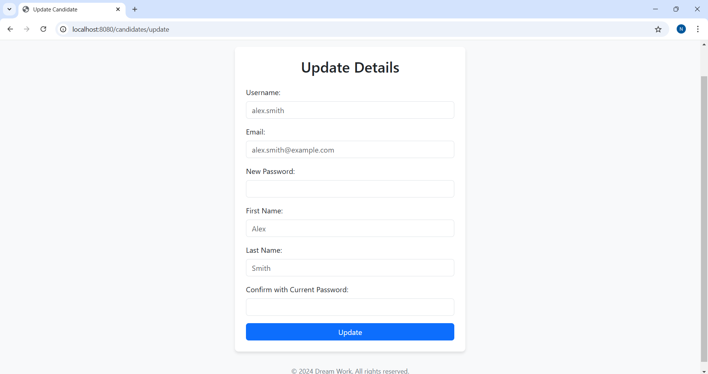
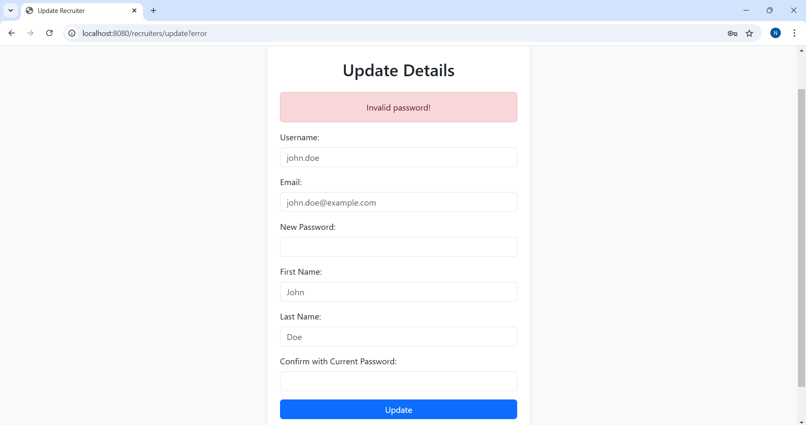
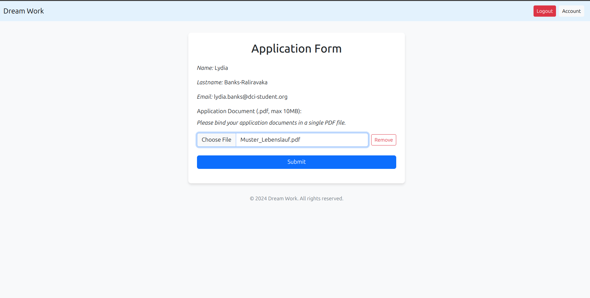
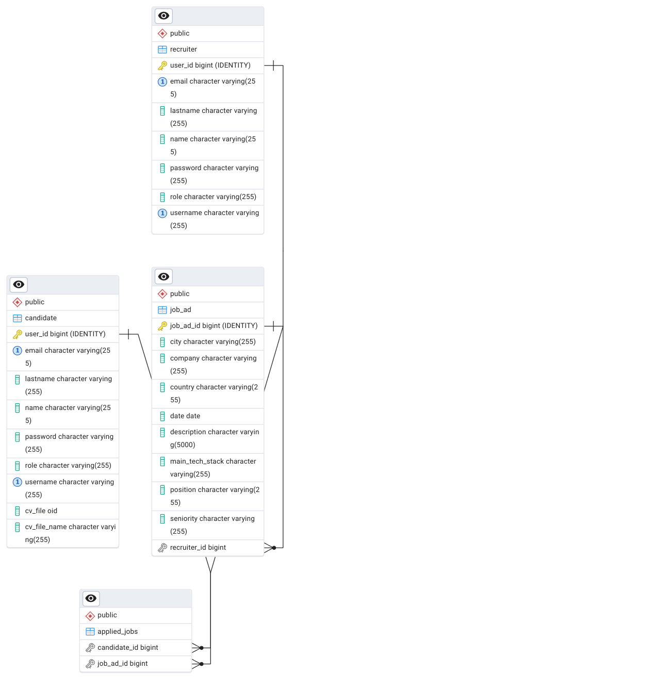

# Dream Work

## Overview
### What is Dream Work and who is it for?
Dream work is a job tracking tool is designed to simplify the hiring process for tech positions and profiles.
It enables recruiters to post job ads, view applicants, and directly contact candidates via email or phone.
While it currently does not track application statuses, the tool provides a minimalistic display that prioritises simplicity and clarity.
This straightforward design helps recruiters avoid being overwhelmed by excessive action buttons, allowing them to focus on what matters: directly reaching out to candidates. By reducing automation, the tool ensures that candidates have a direct line of contact with recruiters, fostering a more personal and efficient recruitment process.

### What technologies do we use?
- For the backend, we are working with:
    - Java 21 (Amazon Corretto 21)
    - Spring Boot which has been used as a framework for building Java-based web applications, providing comprehensive infrastructure support.
- For Database, we are working with:
    - PostgreSQL 16 for managing data persistence and ensuring reliability.
- Frontend:
    - Thymeleaf: for web and standalone environments, used to render dynamic HTML views.
    - Bootstrap 5: A popular front-end framework that provides responsive design and a collection of CSS and JavaScript components for a smooth user experience.
- Authentication:
    - Spring Security: A powerful and customizable authentication and authorization framework for securing applications.
- Testing:
    - JUnit 5, to test individual components of the service layer.
    - Mockito, to mock objects to isolate the behaviours of the service classes and simulate interactions with dependencies.
    - Spring Boot Test, to test the application in a real environment.

### Architectural Design
The architecture of the **Dream Work** job tracking tool follows a **layered architecture** to ensure separation of concerns and maintainability. The key layers in the system include:

1. **Presentation Layer (Frontend)**:
- **Thymeleaf** templates and **Bootstrap 5** handle the rendering of dynamic HTML pages, ensuring the user interface is responsive and user-friendly. This layer interacts directly with the user, collecting input and presenting information.

2. **Application Layer (Backend)**:
- The backend is built with **Spring Boot**, which structures the application in a RESTful style, providing endpoints for job advertisements, user registration, login, and candidate management.
- **Spring Security** ensures authentication and authorization, with **JWT (JSON Web Token)** used for stateless user sessions.

3. **Service Layer**:
- Business logic is handled in **Service classes** that encapsulate the core operations like job ad creation, candidate applications, and recruiter interactions. This layer performs all necessary calculations and data manipulations before sending the information to the persistence layer or returning it to the frontend.

4. **Persistence Layer**:
- **PostgreSQL 16** is used as the relational database management system (RDBMS), ensuring data consistency and reliability.
- **JPA (Java Persistence API)** is employed to interact with the database, with repositories handling CRUD operations for entities like `JobAd`, `Candidate`, and `Recruiter`.

5. **Testing Layer**:
- Unit tests using **JUnit 5** ensure the correctness of business logic.
- **Mockito** is used for mocking dependencies to isolate tests, and **Spring Boot Test** allows integration testing with the actual application context.

This architecture is designed to scale with ease, with the backend remaining decoupled from the frontend. Adding new features or changing existing functionality should not impact other parts of the system significantly, allowing for flexibility and maintainability over time.

## How to install our application
### Prerequisites
Please ensure you have the following software and configurations installed:
- Java Development Kit (JDK): Version 21 or later. You can retrieve it from Oracle's [official website](https://www.oracle.com/uk/java/technologies/downloads/).
- Maven: Ensure Apache Maven (3.9.5 or later) is installed and properly configured on your system before proceeding. If not, you can download it from Maven's [official website](https://maven.apache.org/download.cgi).
- PostgreSQL Database: Version 16.4 or later, which you can download on the [official page](https://www.postgresql.org/download/).
- Git: to clone the repository on your local machine
- Operating System: our application can be run on any OS, provided the previous prerequisites are met.

### Set up your database
In order to have the application running, you need to have a database set up and your application configured accordingly.
1. Create a new database via your database client (e.g., psql, pgAdmin, or DBeaver): `CREATE DATABASE job_tracking_tool;`
2. Configure `application.properties`:
   Update the database connection details in the application.properties file located in the src/main/resources directory. Example:
   ```
   spring.datasource.url=jdbc:postgresql://localhost:5432/job_tracking_tool
   spring.datasource.username=<your-database-username>
   spring.datasource.password=<your-database-password>
   spring.datasource.driver-class-name=org.postgresql.Driver
   ```
   Replace `<your-database-username>` and `<your-database-password>` with your actual PostgreSQL credentials.
3. Let the Application Handle Schema Creation:
   When you run the application for the first time, Spring Boot will automatically create the necessary tables in the database based on the entity classes, thanks to the `spring.jpa.hibernate.ddl-auto=update` property.

### Run the application
- Make sure that your database is created and set up in the project by checking [application properties](src/main/resources/application.properties).
- In your IDE, run the [DreamworkApplication](src/main/java/com/dreamwork/DreamWorkApplication.java) file.
- Go to your browser and go to your [localhost](http://localhost:8080).


## User Guide
### System Overview
The Job Tracking Tool simplifies the recruitment process by providing tailored functionalities for both candidates and recruiters:
#### Candidate Features
Candidates can:
- Register and log in to access their accounts.
- Create and update profiles with their details.
- Apply for jobs by submitting applications and uploading CVs.

#### Recruiter Features
Recruiters can:
- Post and manage job advertisements to attract suitable candidates.
- View applicants who have applied for their job postings.
- Delete job ads once positions are filled or the ad is no longer relevant.


### User Interface Overview
The application features a clean and intuitive layout designed for ease of use:

#### Landing page
The landing page takes you to the list of all open vacancies, limited to 10 per page, and a filtering option to filter jobs by date, location, seniority, or tech stack. Added to this, the user has access to the navigation menu.


#### Navigation Menu
Located at the top of every page, the menu provides quick access to essential sections such as *Home* (with the name of our website, top left), *Login/Logout* (based on the user being connected or not) and *Account/Register* (based on the user being connected or not).


Upon logging in, users are directed to their dashboard.

#### Register and Log In
The application provides two essential entry points for users: Register and Log In.
##### Register
New users can create an account by providing the following details:
- Candidates: Full name, email, password.
- Recruiters: Full name, email, password, and company name.
  After registering, users are redirected to the Login page to access their respective dashboards.
  
##### Log In
Registered users can access their accounts by entering their email and password.
- Role-Based Access: Depending on the role (Candidate or Recruiter), users are redirected to the appropriate dashboard upon successful login.
- Error Handling: Incorrect credentials trigger an error message prompting the user to retry.
  

#### Job description page
This page displays the full details of a specific job ad. 
- Job Description Section: Provides the complete details of the job, including:
    - Position title
    - Location (country and city)
    - Seniority level
    - Required technology stack
    - Detailed description of the role and responsibilities
- Apply Button: At the bottom of the job description, candidates logged in can click the Apply button to submit their application for this job. 

#### Apply page
When a candidate clicks the Apply button on the Job Details Page, they are redirected to a page with:
- A form to upload their CV.
- A submit button to confirm their application for the job.
  


#### Candidate Dashboard page
Once the candidate logged in clicks on **Account**, the page will be redirected to the candidate dashboard, which provides personalized navigation and action options:
- **Personalized Welcome Message**: Displays the candidate's full name for a welcoming touch. 
- **Update Account Button**: Allows the candidate to edit their profile details.
- **Applied Job Ads Button**: Redirects the candidate to a page listing all jobs they have applied to. 
- **Delete Account Button**: Redirects to a confirmation page where the candidate must enter their password to proceed with deleting their account.
  

##### *Update Account page*
When a candidate clicks **Update Account**, they are redirected to a form where they can update their account details.
The form includes input fields for:
- First Name
- Last Name
- Password (to update the account password)
- Current Password (to confirm the update)
A **Update** button allows the user to confirm the updates.
  

If the current password is incorrect, an error message will be displayed.
  

##### *Applied Job Ads page*
When a candidate clicks **Applied Job Ads** from their dashboard, they are redirected to a page that lists all jobs they have applied to.
- **Job Ads List**: Each job ad is displayed with:
    - Position title
    - Company Name
    - Date of Publication
- **Clickable Job Ads**: Each job title is clickable and redirects to the Job Details Page, allowing the candidate to revisit the job description.
  


##### *Delete Account page*
When a candidate clicks **Delete Account**, they are redirected to a page to confirm the deletion of their account.
The page displays a confirmation message, such as:
"Are you sure you want to delete your account? This action cannot be undone."
Below the confirmation message, there is:
- A password input field to verify the user's identity.
- A **Confirm Delete** button to proceed with the account deletion.
  


#### Recruiter Dashboard page
Once the recruiter logged in clicks on **Account**, the page will be redirected to the recruiter dashboard.
The dashboard displays:
- **Personalized Welcome Message**: Displays the recruiter's full name to create a professional and user-friendly experience. 
- **Update Account Button**: Enables the recruiter to edit their details. 
- **Create Job Ads Button**: Opens a form for the recruiter to create a new job posting with details like position, location, and requirements. 
- **Listed Job Ad Button**: Redirects to a page showing all the job ads created by the recruiter.
- **Delete Account Button**: Redirects to a confirmation page where the recruiter must provide their password to delete their account permanently along with any created job ad. 
  

##### *Update Account page*
When a recruiter clicks **Update Account**, they are redirected to a form where they can update their account details.
The form includes input fields for:
- First Name
- Last Name
- Password (to update the account password)
- Current Password (to confirm the update)
A **Update** button allows the user to confirm the updates.
  

- If the current password is incorrect, an error message will be displayed.
  

##### *Create Job Ad page*
When a recruiter clicks Create Job Ads on the dashboard, they are redirected to a form page to create a new job ad.
The form includes input fields for:
- Position Title
- Date of Publication
- Company Name
- Country
- City
- Seniority Level (e.g., Junior, Mid-Level, Senior)
- Technology Stack (e.g., Java, Spring Boot, React)
- Job Description

At the bottom of the form, there is a Submit button to save the job ad.


Once submitted, the job ad will appear in the Listed Job Ads section.

##### *Listed Job Ads Page*
When a recruiter clicks **Listed Job Ads**, they are redirected to a page that displays all job ads they have created.
- **Job Ads List**: Each job ad is displayed with:
    - Position title
    - Company Name
    - Location (country and city)
    - Date of Publication
- **Clickable Job Ads**: Each job title is clickable and redirects to the Job Details and Applicants Page.
  

###### Job Details and Applicants Page (from Listed Job Ads)
When a recruiter clicks on a job from the Listed Job Ads Page, they are redirected to this page, which provides:
- **Job Details Section**, which displays:
    - Position title
    - Location (country and city)
    - Seniority level
    - Technology stack
    - Job description
- **Applicants List Section**: Below the job details, this section lists all applicants for the job ad, with:
    - Candidate first and last name,n displayed as plain text.
    - Candidate' email: A clickable email link.
    - CV Link: A clickable link that opens the CV in a new tab.
- **Back to job list button**: a button that lets the recruiter go back to the list of job ads they created.
- **Delete Job Ad Button**: At the bottom of the page, a Delete Job Ad button allows the recruiter to delete the job ad. A confirmation prompt ensures intentional deletion.
  
  


##### *Delete Account page*
When a recruiter clicks **Delete Account**, they are redirected to a page to confirm the deletion of their account.
The page displays a confirmation message, such as:
"Are you sure you want to delete your account? This action cannot be undone."
Below the confirmation message, there is:
- A password input field to verify the user's identity.
- A **Confirm Delete** button to proceed with the account deletion.
  


### How to Use the Application
For step-by-step instructions on how to use the application, provide detailed, yet clear explanations of common tasks, possibly illustrated with screenshots. Here's a breakdown of tasks based on your features:

#### Candidate Instructions
##### Registering as a Candidate
- Step 1: On the homepage, click on the Register button.
- Step 2: Fill in the registration form with your
    - username,
    - password,
    - first name,
    - last name,
    - email, and
    - select in the dropdown the role **CANDIDATE**.
- Step 3: Click **Register** to create your account.
  

##### Logging In
- Step 1: Navigate to the login page.
- Step 2: Enter your registered email and password.
- Step 3: Click **Login** to access your candidate dashboard.
  

##### Applying for Jobs
- Step 1: From the home page, browse the job listings. 
- Step 2: Click on a job ad to view more details. 
- Step 3: If interested, click the Apply button. 
- Step 4: To apply, select a CV from your computer. Click on Choose File. 
- Step 5: Select the file from your computer and upload it.
- Step 6: Your application will be submitted, and you can track it. 

##### Track Applied Jobs
- Step 1: From the dashboard, click on the Applied Job List page. 
- Step 2: A list of all job ads you have applied to is displayed. Each job ad shows:
    - Position title
    - Company Name
    - Date of Publication
- Step 3: Click on any job title in the list to view its full description on the Job Details Page.
- Step 4: Review the Details: Revisit the job description to check for any additional details or updates. 


#### Recruiter Instructions
##### Registering as a Recruiter
- Step 1: On the homepage, click on the Register button.
- Step 2: Fill in the registration form with your
    - username,
    - password,
    - first name,
    - last name,
    - email, and
    - select in the dropdown the role **RECRUITER**.
- Step 3: Click **Register** to create your account.
  

##### Logging In
- Step 1: Navigate to the login page.
- Step 2: Enter your registered email and password.
- Step 3: Click **Login** to access your candidate dashboard.
  

##### Creating a Job Ad
- Step 1: From the dashboard, click on **Create Job Ad**. 
- Step 3: Fill in the form with details such as
    - position,
    - date of publication,
    - company name,
    - country,
    - city,
    - seniority level,
    - main tech stack and
    - description.
- Step 4: Click **Create Job Ad** to make the job visible to candidates.
  
  

##### Viewing Applicants
- Step 1: From the dashboard, navigate to the **Listed Job Ads** section. 
- Step 2: Click on a job ad to view its applicants. 
- Step 3: Review applicants and contact them directly if needed. 

##### Deleting a Job Ad
- Step 1: From the **Job Details** page, locate the **Delete Job Ad** button.


- Step 2: Click the Delete Job Ad button to initiate the deletion. 
- Step 3: Confirm the deletion in the pop-up dialog by clicking **Yes**.
- Step 4: Once confirmed, the job ad is removed, and you are redirected back to the **Listed Job Ads** page.


## Database Schema
### Schema Diagram
Here is am overview of the structure of our current database, with the relationships between each table visible.


### Tables, Relationships, and Attributes
#### User Table
- **Purpose**: Serves as the base table for user accounts, containing shared attributes for both recruiters and candidates.
- **Attributes**:
    - `user_id` (Primary Key): A unique identifier for each user.
    - `email`: The user’s email address, used for communication.
    - `username`: The user’s login username.
    - `password`: The hashed password for authentication.
    - `name`: The user's first name.
    - `lastname`: The user's last name.
    - `role`: Defines whether the user is a candidate or recruiter.
- **Relationships**:
  Extended by the recruiter and candidate tables.

#### Candidate Table
- **Purpose**: Represents candidates who can apply for jobs and upload CVs.
- **Attributes**:
    - Inherits all attributes from the `user` table.
        - `user_id` (Primary Key): Unique identifier for the candidate.
        - `email`: Email address of the candidate.
        - `lastname`: Last name of the candidate.
        - `name`: First name of the candidate.
        - `password`: Encrypted password for secure authentication.
        - `role`: selects whether the user is a candidate or recruiter.
        - `username`: username of the candidate
    - `cv_file`: stores the binary data of the uploaded CV of the candidate when last applied to a job
    - `cv_file_name`: name of the uploaded CV
- **Relationships**:
  Many-to-Many with job_ad through the applied_jobs table.


#### Recruiter Table
- **Purpose**: Represents recruiters who can create job ads and view applicants.
- **Attributes**:
    - Inherits all attributes from the `user` table.
        - `user_id` (Primary Key): Unique identifier for the recruiter.
        - `email`: Email address of the recruiter.
        - `last_name`: Last name of the recruiter.
        - `name`: First name of the recruiter.
        - `password`: Encrypted password for secure authentication.
        - `role`: selects whether the user is a candidate or recruiter.
        - `username`: username of the recruiter
- **Relationships**:
  One-to-Many with `job_ad`: A recruiter can create multiple job ads.


#### Job Ad Table
- **Purpose**: Represents job advertisements posted by recruiters.
- **Attributes**:
    - `job_ad_id` (Primary Key): Unique identifier for the job ad.
    - `city`: name of the city in which the job is located.
    - `company`:
    - `country`: name of the country in which the job is located.
    - `date`: date of publication of the job ad.
    - `description`: provides details regarding the job ad.
    - `main_tech_stack`: keywords of technologies used for the position.
    - `position`: name of the position advertised.
    - `seniority`: level of experience required for the position
    - `recruiter_id` (Foreign Key): `user_id` of the recruiter who has created the job ad.
- **Relationships**:
  Many-to-One with `recruiter`.
  Many-to-Many with `candidate` through the `applied_jobs` table

#### Applied Jobs Table
- **Purpose**: Acts as a junction table for managing applications from candidates to job ads.
- **Attributes**:
    - `candidate_id` (Foreign Key): Unique identifier for the candidate who has applied to a job.
    - `job_ad_id` (Foreign Key): Unique identifier for the job ad the candidate has applied to.
- **Relationships**:
  Many-to-Many between candidate and job_ad.

### Relationships between Tables
- **Inheritance**: The recruiter and candidate tables inherit from the user table.
- **One-to-Many**: A recruiter can post multiple job_ads.
- **Many-to-Many**: Candidates and job ads are connected through the applied_jobs table, allowing multiple candidates to apply to multiple jobs.

### Data Types
- Most fields use `character varying` to store text data (e.g., name, email).
- Numeric IDs use `bigint` for scalability.
- Dates are stored using the `date` data type.
- Binary files (CVs) are stored using the `oid` type, with filenames stored as text for retrieval.


## Class and Method Documentation
The generated Javadoc is available in the `docs` folder at the root of the project.
Open [this link](docs/index.html) in a browser to browse the documentation.


## Credits and Acknowledgments
We would like to express our gratitude to the following libraries, frameworks, and resources that were essential in the development of **Dream Work**:
- Spring Boot
- Spring Security
- Thymeleaf
- Bootstrap 5
- JUnit 5
- Mockito
- PostgreSQL 16


We also thank any other open-source contributors whose work made the development of this project possible.
